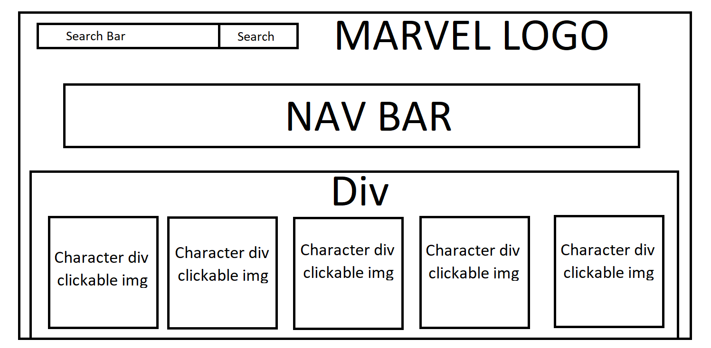

# Info-Hero

A database allowing users to search for Marvel characters and learn more about the Marvel world.

I used Ajax to retrieve information from the Marvel API. I created boxes for each character using Jquery, then populated them with the information provided by the API. Using CSS I styled each box to have a more rounded shape and gave them shadows to add depth as well as the ability to "pop out" of the screen toward the user.

<a href="https://derrickjfoster.github.io/">Info-Hero Home Page</a>
